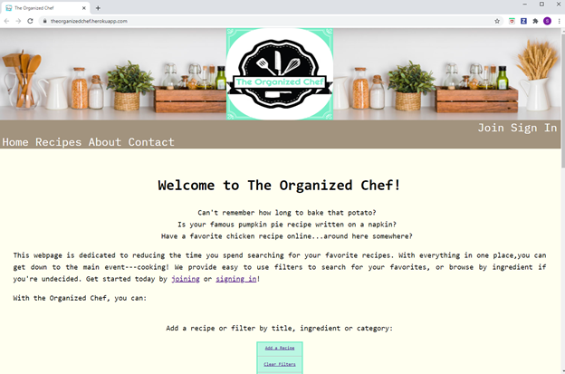
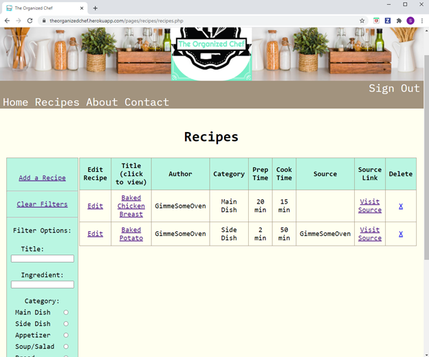
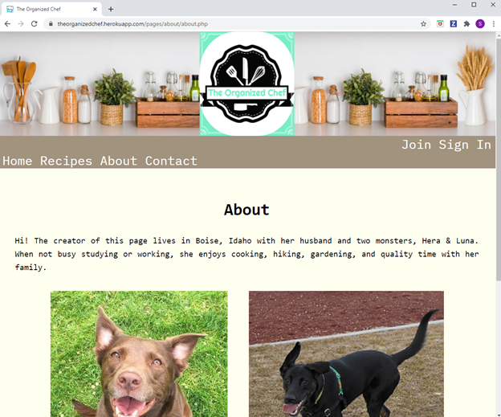
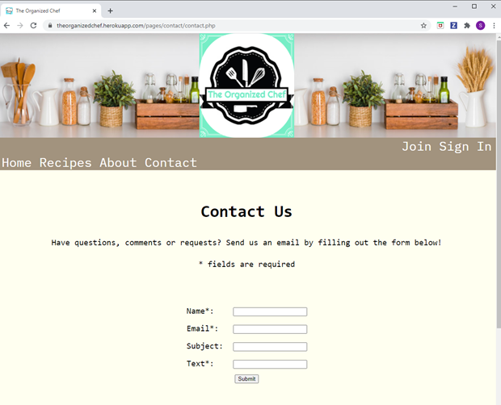

# The Organized Chef: Web Application
### Authors: Susan Higginbotham
### CS401- Web Development final project

## Overview
This web application is a recipe repository. The website can be viewed at: [theorganizedchef](https://theorganizedchef.herokuapp.com/).  



## Technologies used
* PHP
* HTML
* CSS
* Heroku Hosting
* Git version control
* ClearDB MySQL
* MySQL Workbench

## Home
The home page describes the websites function & displays screenshots of the recipe page features. 

## Recipes
The Recipes page is the heart of the application. Here a user can add, edit, view, search for, or delete recipes. 

## About
The About page offers information about the creator. 

## Contact
Users can contact the author via the Contact page form: 

